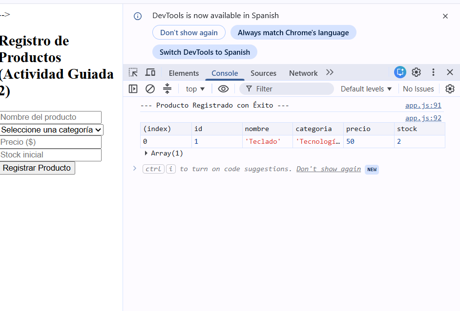
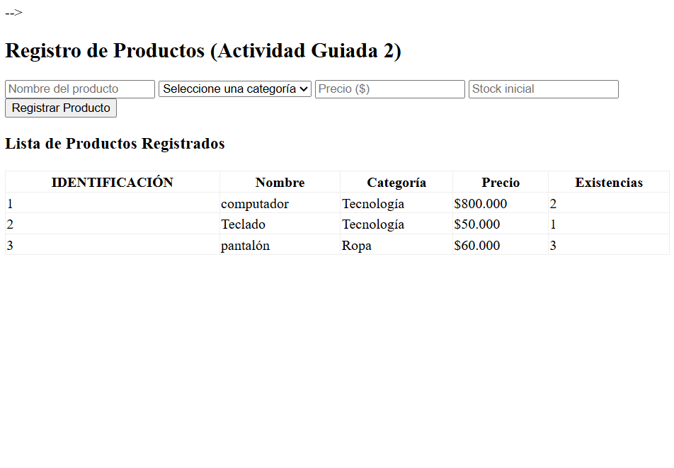
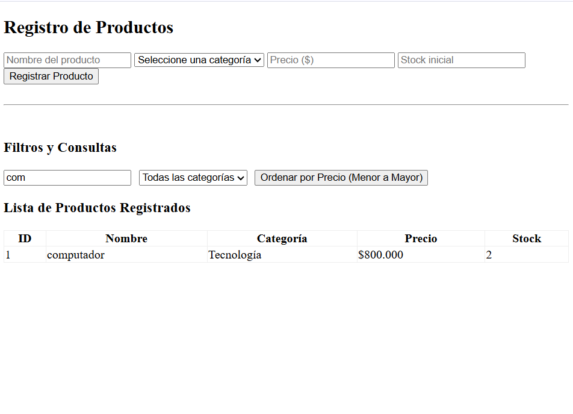
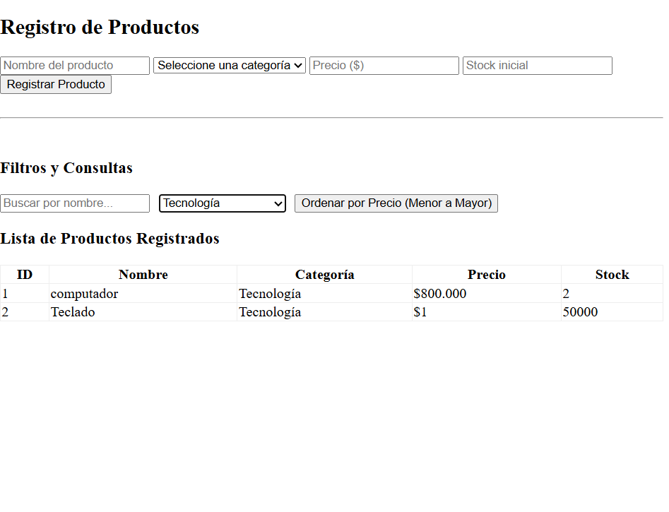
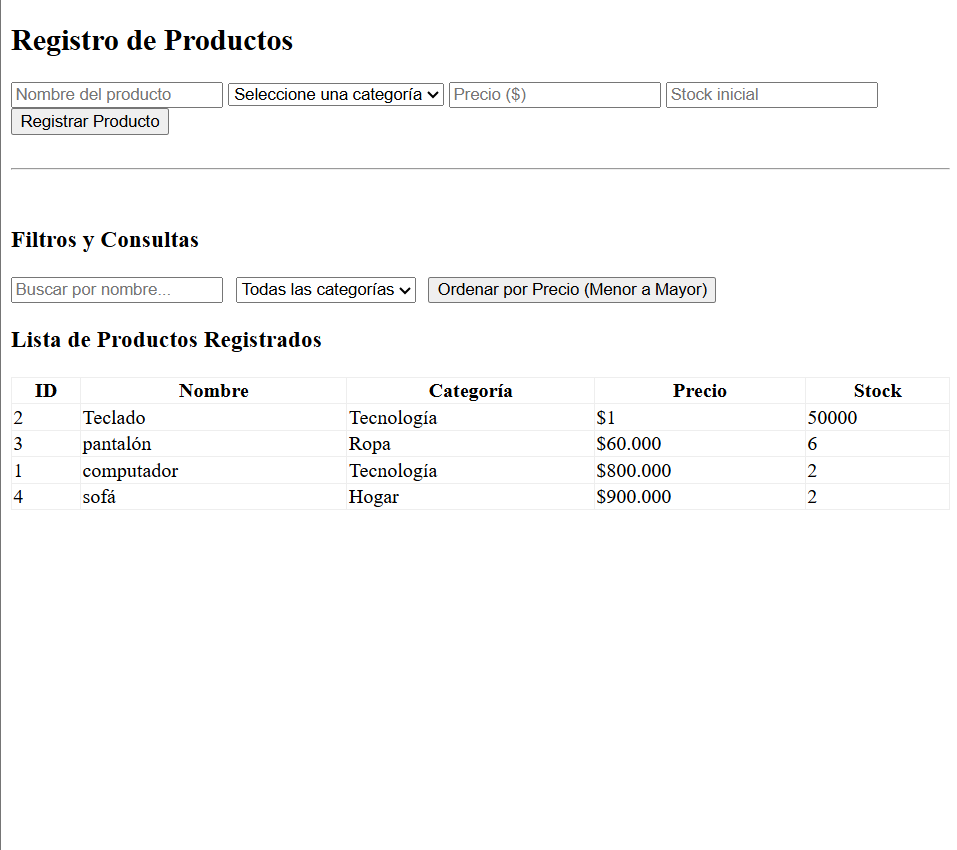

# Sistema de Inventario en Memoria - Guia 3 (Arreglos, Objetos y JSON)

## Informacion del Aprendiz
* **Nombre:** Nelson Fabio Leon Rodriguez
* **Programa:** Tecnologo en Analisis y Desarrollo de Software (ADSO)
* **Institucion:** Servicio Nacional de Aprendizaje (SENA)

---

## Descripcion del Proyecto
Este proyecto consiste en una aplicacion web interactiva desarrollada en JavaScript vanilla para la gestion y administracion de un inventario de productos en memoria. Se da cumplimiento a las actividades guiadas y los criterios exigidos para alcanzar el Nivel Alto en la Guia de Aprendizaje No. 3, aplicando conceptos modernos de manipulacion de estructuras de datos (Arreglos de Objetos), metodos iterativos, ordenamiento, filtrado avanzado y estructuracion JSON.

---

## Tecnologias Utilizadas
* **HTML5:** Estructuracion semantica de formularios, tablas y controles de filtrado.
* **CSS3:** Diseno basico y organizacion visual.
* **JavaScript (ES6+):** Programacion logica del sistema empleando:
  * Manejo del DOM y eventos avanzados (submit, input, change).
  * Metodos de arreglos modernos: forEach(), filter(), sort(), y reduce().
  * Serializacion de datos usando JSON.stringify() y JSON.parse().

---

## Evidencias de Aprendizaje

### 1. Actividad Guiada 1: Lista Dinamica de Nombres (Punto 8)
Evidencia del funcionamiento inicial del manejo de arreglos basicos y manipulacion del DOM para enlistar elementos de texto.
* **Captura inicial:**
  
* **Captura de verificacion:**
  

### 2. Actividad Guiada 2: Registro de Objetos en Consola (Punto 9)
Evidencia de la creacion dinamica de objetos literales con identificadores unicos incrementales y almacenamiento exitoso dentro del arreglo global visualizado mediante console.table().

### 3. Actividad Guiada 3: Renderizado de Tabla en la Interfaz (Punto 10)
Demostracion de la sincronizacion en tiempo real entre los objetos en memoria y el DOM, insertando filas dinamicamente en una tabla HTML mediante el uso del metodo forEach().

### 4. Actividad Guiada 4: Busqueda y Filtrado Avanzado (Punto 11)
Evidencias del comportamiento de los algoritmos de consulta reactivos en la interfaz:
* **Vista general de la interfaz de filtros:**
  .png)
* **Busqueda por nombre en tiempo real:**
  
* **Filtrado estricto por categoria seleccionada:**
  
* **Ordenamiento de menor a mayor precio:**
  

### 5. Actividad Guiada 5: Conversion e Intercambio de Datos JSON (Punto 12)
Validacion de la persistencia teorica mediante la conversion del arreglo activo de objetos a una cadena de texto plana con comillas dobles y su posterior reconstruccion inversa.

### 6. Proyecto Integrador: Panel de Estadisticas Dinamicas (Puntos 13 y 17)
Calculo de metricas operacionales del inventario requeridas para el nivel alto de la guia:
* Acumulacion del valor financiero total (Precio * Stock) implementando el metodo reduce().
* Deteccion automatica de elementos con stock critico (menos de 3 unidades) mediante filter().

---

## Conclusiones de Desarrollo
1. **Separacion de Responsabilidades:** Se asimilo la importancia de mantener los arreglos de datos puros en memoria antes de pasarlos a las capas visuales del DOM.
2. **Inmutabilidad:** El uso del operador spread permitió ordenar las colecciones financieras de los productos sin alterar los indices ni comprometer el inventario base.
3. **Preparacion para Persistencia:** La serializacion a JSON deja la estructura del software lista para integrarse con mecanismos de persistencia local (LocalStorage) o interconexion con APIs externas en etapas posteriores.